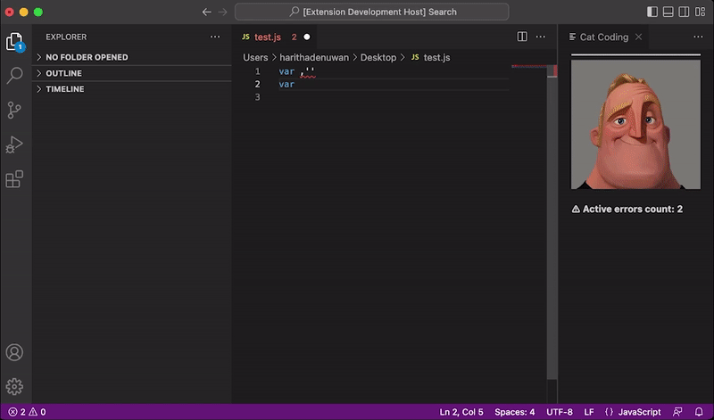

# Mr. Incredible becoming uncanny with the amount of errors in your code! (WIP) (NOT OC)

Haha not my original idea, but I had to try this one for self-satisfication.

## 🧿 Features !

Well, this VS Code extension is written in javascript (Ts boo) and detects the number of errors in your code and according to the error level it changes the image.
There are 4 levels that triggers the image to change,
 - Low level | 0 < count < 2
 - Moderate level | 2 < count < 5
 - Severe level | 5 < count < 10
 - Critical level | count > 10

This uses a Webview panel and it is updating with the values of error that get detected with each keystroke that user enters on the active text editor. Will improve it more in the future but heres the current preview of the extension.

## 🛠️ How to run the example !
You can try it as an example if you want. Give it a try!

- Open this example in VS Code 1.49+
- `npm install`
- `npm run watch` or `npm run compile`
- `F5` to start debugging
- `Shift+Cmd+P` to open the command palette
- `Hello World` to run the extension

*you might need to change the layout according to your preference :)

## 📄 Related Docs !
- VS Extension API : https://code.visualstudio.com/api
- VS Extension Webview API : https://code.visualstudio.com/api/extension-guides/webview

